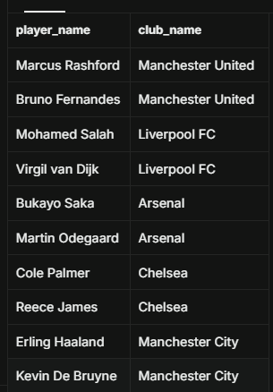
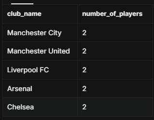
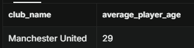
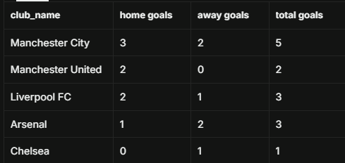

# Football Club SQL Analysis
This repository contains SQL exercises and relation database analysis completed during my training.

## Project Overview
This project uses PostgreSQL to design a relational database for football clubs, players and match results. 
It demonstrates core SQL skills including:
- Database creation 
- Data insertion
- Filtering and sorting
- JOIN operations
- Aggregations (COUNT, AVG, SUM)
- Basic data analysis using SQL

## Dataset
The dataset includes three tables:
- clubs – club information (name, stadium, city)
- players – player details (name, position, age, club)
- matches – match results (home/away teams and goals)

The full database creation script can be found in the `database` folder.

## Source Code
All SQL analysis queries can be found in the `football-club-SQL-analysis-queries.sql` file.

These queries include:
- Listing players and clubs
- Filtering by age, position, or city
- Joining players with their clubs
- Counting players per club
- Calculating average player age
- Summing total goals scored by each club (home + away)

## Skills Demonstrated
This project highlights:
- Relational database design
- Writing SQL queries for analysis
- Using JOINs to combine data across tables
- Using GROUP BY and aggregate functions
- Extracting insights from structured data

## Example Insights

###  Finding Players and Their Clubs
This query uses an INNER JOIN to display player names alongside the club they play for.
```
select player_name, club_name from players inner join clubs on players.club_id = clubs.club_id;
```


### Counting Players at Each Club
This query uses COUNT() and GROUP BY to determine how many players are in each club.
```
select club_name, count(player_name) as number_of_players 
from players
inner join clubs
on players.club_id=clubs.club_id
GROUP BY club_name;
```


### Average Age of Manchester United Players
This query uses AVG() to calculate the average age of players at Manchester United.

```
select club_name, round(avg(age),0) AS average_player_age
from players
inner join clubs
on players.club_id=clubs.club_id
WHERE club_name = 'Manchester United'
GROUP BY club_name;
```


### Total Goals Scored by Each Club
This query combines match data to calculate total goals scored by each club.
```
select 
c.club_name,
SUM(h.home_goals) AS "home goals",
SUM(a.away_goals) AS "away goals",
SUM(h.home_goals) + SUM(a.away_goals) AS "total goals"
from clubs c
join matches h on c.club_id = h.home_club_id
join matches a on c.club_id = a.away_club_id
group by club_name;
```

